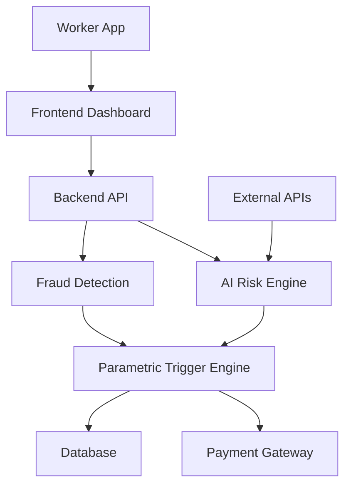
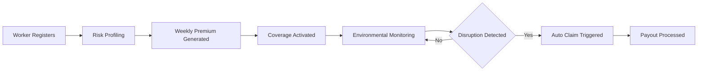

# 🚀 Earnova


### 🏆 Guidewire DEVTrails 2026 Submission  
**Team:** Optimizers

---

# 📌 Overview

**Earnova** is an AI-powered parametric insurance platform designed to protect **gig delivery workers** from income loss caused by external disruptions such as **heavy rain, extreme heat, pollution, floods, or curfews**.

Delivery partners rely on daily work hours to earn income. When environmental disruptions occur, they often lose earnings with no financial safety net.

Earnova solves this by combining:

- 🌧 Environmental monitoring  
- 🤖 AI-based risk prediction  
- ⚡ Automated parametric claim triggers  
- 💳 Instant payout simulation  

The platform automatically detects disruptions and **initiates compensation for lost income without manual claims.**

---

# 🎯 Problem Statement

Gig workers often lose **20–30% of their monthly income** due to environmental or social disruptions.

| Disruption | Examples | Impact |
|-----------|----------|--------|
| 🌧 Weather | Heavy rain, floods, extreme heat | Deliveries halted |
| 🌫 Pollution | Hazardous AQI levels | Unsafe working conditions |
| 🚧 Social | Curfews, strikes, zone closures | Delivery routes blocked |

Currently, gig workers have **no insurance protection for such income loss.**

---

# 💡 Our Solution

Earnova uses **parametric insurance**, where payouts are triggered automatically when disruption conditions are met.

### How It Works

1️⃣ Worker activates weekly protection  
2️⃣ System monitors environmental conditions  
3️⃣ AI calculates disruption risk  
4️⃣ Parametric trigger activates claim  
5️⃣ Instant payout is processed  

This creates a **zero-touch insurance experience for gig workers.**

---

# ✨ Key Features

| Feature | Description |
|-------|-------------|
| 🤖 AI Risk Assessment | Predict disruption probability |
| 💰 Weekly Premium Model | Affordable micro-insurance |
| ⚡ Automatic Claims | Disruptions trigger payouts |
| 🛡 Fraud Detection | Detect suspicious claims |
| 📊 Analytics Dashboard | Worker & admin insights |

---

# 🏗 System Architecture



---

# 🔄 Workflow



---

# 📡 API Research & Data Sources

Earnova integrates multiple APIs to detect disruptions.

| API | Purpose | Example |
|----|--------|--------|
| 🌧 Weather API | Detect rainfall & extreme heat | OpenWeatherMap |
| 🌫 Pollution API | Monitor AQI levels | AQICN |
| 🌍 Disaster API | Flood & disaster alerts | NASA EONET |
| 📍 Location API | Worker location detection | Google Maps |
| 🗺 Map API | Risk zone visualization | Mapbox / Leaflet |
| 🔔 Notification API | Alerts to workers | Firebase FCM |
| 🔐 Auth API | Secure login | Firebase Auth |
| 💳 Payment API | Weekly payments & payouts | Razorpay |

---

# 💰 Weekly Premium Calculation

Earnova dynamically calculates weekly premiums using risk scoring.

```
Weekly Premium = Base Rate × Risk Score × Coverage Factor
```

Example:

```
Base Rate = ₹30
Risk Score = 1.3
Coverage Factor = 1.2

Premium ≈ ₹47 per week
```

---

# ⚡ Parametric Triggers

| Trigger | Condition | Action |
|-------|----------|-------|
| 🌧 Heavy Rain | Rainfall > 50mm | Auto compensation |
| 🌫 Severe Pollution | AQI > 400 | Coverage activated |
| 🌊 Flood Alert | Disaster alert issued | Claim triggered |
| 🚧 Curfew | Zone closure detected | Income protection |

---

# 🤖 AI Models

### Risk Prediction
Predicts disruption probability using:

- Weather history
- Pollution data
- Flood zones
- Traffic patterns
- Delivery demand

### Fraud Detection
Detects anomalies such as:

- GPS spoofing  
- Duplicate claims  
- False disruption reports  

Possible algorithms:

- Random Forest  
- Gradient Boosting  
- Isolation Forest  

---

# 🛠 Tech Stack

| Layer | Technology |
|------|------------|
| Frontend | React.js |
| Backend | Node.js, Express |
| Database | MongoDB |
| AI/ML | Python, Scikit-Learn |
| Maps | Google Maps API |
| Payments | Razorpay / Stripe |

---

# 📊 Dashboard

### Worker Dashboard
- Active weekly protection
- Earnings protected
- Claim history

### Admin Dashboard
- Risk analytics
- Fraud alerts
- Disruption heatmaps

---

# 🎥 Demo

Demo Video  
```
Add demo video link
```

Live Prototype  
```
Add deployment link
```

---

# 💼 Business Model & Impact

Earnova follows a **weekly micro-insurance subscription model** designed for gig workers.

| Tier | Weekly Premium | Protection |
|----|---------------|-----------|
| Basic | ₹20–30 | ₹500 coverage |
| Standard | ₹40–60 | ₹1000 coverage |
| Premium | ₹70–100 | ₹2000 coverage |

### Market Opportunity

- 15M+ gig workers in India  
- Rapidly growing gig economy  
- Potential to protect millions of workers from income instability

---

# 👥 Team Optimizers

| Role | Contribution |
|-----|--------------|
| System Design | Architecture & planning |
| Backend | APIs & insurance logic |
| Frontend | User interface |
| AI | Risk prediction & fraud detection |

---

# 🚀 Future Improvements

- Hyper-local risk prediction  
- Multi-platform gig worker coverage  
- Advanced fraud detection  
- Real-time disruption heatmaps  

---

<p align="center">
Made with ❤️ by <b>Team Optimizers</b>
</p>

<p align="center">
© 2026 Earnova Project — All Rights Reserved
</p>