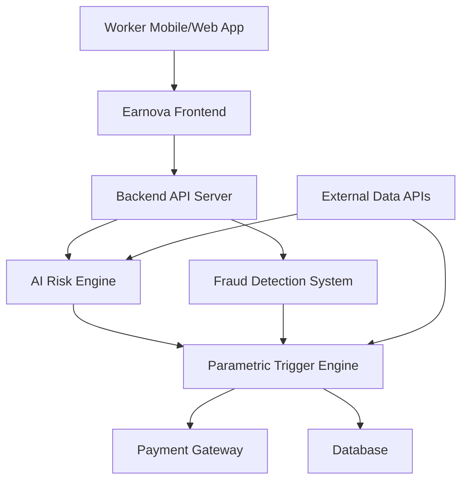
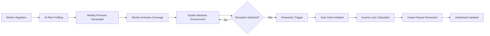

# 🚀 Earnova


### 🏆 Guidewire DEVTrails 2026 Hackathon Submission  
**Team Name:** Optimizers

---

# 📌 Overview

**Earnova** is an AI-powered parametric insurance platform designed to protect **gig economy delivery partners** from income loss caused by environmental disruptions.

Delivery workers from platforms such as **Zomato, Swiggy, Amazon, Zepto and other logistics services** rely on daily work hours for income. However, external disruptions such as **heavy rainfall, extreme heat, floods, pollution, or curfews** can prevent them from working.

Earnova solves this by providing **automated income protection** using:

- 🌧 Real-time environmental monitoring  
- 🤖 AI risk assessment  
- ⚡ Automated parametric insurance triggers  
- 💳 Instant payout simulation  

Instead of manual claims, **Earnova automatically detects disruptions and processes compensation** for lost income.

---

# 🎯 Problem Statement

Gig workers often lose **20-30% of their earnings** due to external disruptions such as:

| Disruption Type | Examples | Impact |
|----------------|----------|--------|
| 🌧 Environmental | Heavy rain, floods, extreme heat | Delivery operations stop |
| 🌫 Pollution | High AQI levels | Unsafe outdoor working conditions |
| 🚧 Social | Curfews, strikes, market shutdowns | Access to delivery zones restricted |

These workers currently **have no financial safety net** for such disruptions.

Earnova provides **AI-driven income protection designed specifically for gig workers.**

---

# 💡 Our Solution

Earnova introduces a **parametric insurance system** where payouts are automatically triggered when predefined conditions occur.

### Key Idea

Instead of filing claims manually:

1️⃣ External data sources detect disruptions  
2️⃣ AI calculates risk & validates conditions  
3️⃣ Parametric trigger activates claim  
4️⃣ Instant payout is processed

This creates a **zero-touch insurance experience**.

---

# ✨ Key Features

| Feature | Description |
|-------|-------------|
| 🤖 AI Risk Assessment | Predicts environmental risk levels |
| 💰 Weekly Premium Model | Affordable pricing aligned with gig workers |
| ⚡ Automatic Claim Trigger | Disruption automatically activates coverage |
| 🛡 Fraud Detection | Detects suspicious claims |
| 📊 Analytics Dashboard | Worker & Admin insights |

---

# 🏗 System Architecture



---

# 🔄 System Workflow



---

# 📡 API Research & Data Sources

Earnova integrates external APIs to monitor environmental disruptions.

| API Category | Purpose 🎯 | Data Used 📊 | Example APIs |
|--------------|------------|--------------|--------------|
| 🌧 Weather API | Detect rain & extreme heat | Rainfall, temperature, alerts | OpenWeatherMap, WeatherAPI |
| 🌫 Air Pollution API | Detect hazardous air quality | AQI, PM2.5, PM10 | AQICN, OpenWeather Air API |
| 🌍 Disaster API | Detect floods & disasters | Disaster type, location | NASA EONET |
| 📍 Location API | Identify rider location | Latitude, longitude | Google Maps API |
| 🗺 Map API | Visualize disruption zones | Area maps | Mapbox, Leaflet |
| 🔔 Notification API | Send alerts to riders | Push notifications | Firebase FCM |
| 🔐 Authentication API | Secure login | User authentication | Firebase Auth |
| 💳 Payment API | Process payouts | Payment transactions | Razorpay, Stripe |

---

# 💰 Weekly Premium Calculation

Earnova calculates premiums dynamically using AI risk prediction.

### Formula

```
Weekly Premium = Base Rate × Risk Score × Coverage Factor
```

| Parameter | Description |
|-----------|-------------|
| Base Rate | Minimum cost of coverage |
| Risk Score | AI predicted disruption probability |
| Coverage Factor | Level of income protection |

### Example

```
Base Rate = ₹30
Risk Score = 1.3
Coverage Factor = 1.2

Weekly Premium = ₹46.8 ≈ ₹47
```

---

# ⚡ Parametric Trigger Examples

| Trigger | Condition | Action |
|-------|----------|-------|
| 🌧 Heavy Rain | Rainfall > 50 mm | Auto compensation |
| 🌫 Severe Pollution | AQI > 400 | Worker receives payout |
| 🌊 Flood Alert | Flood warning issued | Claim triggered |
| 🚧 Curfew | Delivery zone shutdown | Income protection activated |

---

# 🤖 AI Model Explanation

Earnova uses **two AI modules**.

## Risk Prediction Model

Predicts disruption probability.

### Inputs

- Weather history
- Pollution levels
- Flood zones
- Traffic patterns
- Delivery demand

### Output

```
Risk Score (0.5 – 2.0)
```

Higher risk → higher premium.

---

## Fraud Detection Model

Detects fake claims.

| Fraud Signal | Detection |
|--------------|-----------|
| GPS spoofing | Location verification |
| Duplicate claims | Historical claim analysis |
| Fake weather events | API validation |

Algorithms that can be used:

- Random Forest
- Gradient Boosting
- Isolation Forest
- Logistic Regression

---

# 🛠 Tech Stack

| Layer | Technology |
|------|------------|
| Frontend | React.js |
| Backend | Node.js, Express |
| Database | MongoDB |
| AI / ML | Python, Scikit-Learn |
| Maps | Google Maps API |
| APIs | Weather, Pollution, Disaster |
| Payments | Razorpay / Stripe sandbox |

---

# 📊 Dashboard

### Worker Dashboard

- Active weekly coverage
- Protected earnings
- Claim history

### Admin Dashboard

- Risk analytics
- Fraud alerts
- Claim statistics
- Disruption heatmaps

---

# 🎥 Demo

### 📹 Demo Video
```
Add demo video link here
```

### 🌐 Live Prototype
```
Add deployed application link
```

### 📂 Repository
```
Add GitHub repository link
```

---

# 👥 Team Optimizers

| Role | Contribution |
|-----|--------------|
| Research & System Design | Problem analysis & architecture |
| Backend Development | APIs & insurance logic |
| Frontend Development | User interface |
| AI & Risk Modeling | Risk prediction & fraud detection |

---

# 🚀 Future Improvements

- Hyper-local risk prediction
- Multi-platform gig worker coverage
- Advanced fraud detection
- Real-time disruption heatmaps
- AI-driven policy recommendations

---

# ⭐ Why Earnova?

✔ Designed specifically for gig workers  
✔ Automated parametric insurance model  
✔ AI-driven risk prediction  
✔ Zero-touch claim processing  
✔ Real-time disruption detection